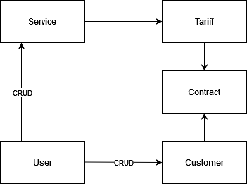

# Global4

Technical for the Global4 interview

## Installation
- Clone the repo 
- Go to the dir and run `docker-compose up -d`
- On the php shell (Either by `Docker Desktop ui` or running `Docket exec -it php bash` in the terminal)
  - cd into the `src` directory 
  - Run `composer install`
  - Then run `npm install && npm run dev`
- You can then go to `localhost` to view the system running
- However, you may need to edit your host file
  - For Windows
    - `C:\Windows\System32\drivers\etc\hosts`
    - Open the `hosts` file in notepad admin
    - Add `127.0.0.1 global4.test`
    - Save and exit
  - For Linux
    - Open a Terminal window.
    - Enter the following command to open the hosts file in a text editor: `sudo nano /etc/hosts`. Or use vim `sudo vim /etc/hosts`
    - Add `127.0.0.1 global4.test`
    - Save and exit

## Breaking down the spec

The spec was very open-ended and allowed a lot of freedom the given but the short summary and user stories give some context.

### Defining the objects
It would be very easy to over engineer this and try to "future-proof" the entities   

The summary explains briefly what some required objects are. As well as some constraints to the behaviour of the system.
The user stories just give us some nice functional requirements but also implies roles and authentication so that needs to be added as well.

After reading the spec for a while I came up with these entities as a bare minimum

- Service: Just holds the service types/names, can have many tariffs.
- Tariff: Linked to a service and can be on many contracts. 
- Customer: Holds basic customer details, can have many contracts.
- Contract: Links a customer to a tariff/service.
- User: Does all the "stuff" in the backend to make all this link and work together.

These can easily be expanded for more properties/behaviours and a lot more entities can be added as well to really flesh this system out. But in the intrest of time this will be the MVP (minimal viable product)

Here is a quick ERD I made while scoping this out

### Behaviours
Every system needs to "do" something and this one allows two sets of users different actions.

An Administrator needs to be able to view/add Services and Tariffs.
 An Telesales Agent needs to be able to view/add Customers and Contracts.

There is no mention in the spec that an Administrator should not be able to do a Telesales Agent's behaviour, and vice versa, but an authentication method as added anyway since it was implied.

In a perfect world these two systems would be separate instances. Keeping the `S` in `SOLID` alive where services should only really do one thing. 
 There could be a service for just adding the Services and Tariffs.
 There then would be another service for the managing of the Customers and Contracts.

While they are "linked" they do not really depend on each other to function, apart from the contract needed to know what tariff its pulling.

Beyond that we have three services provided for us `ADSL`, `FTTC` and `FTTP` as well as some fixed contract lengths.
  It was mentioned here that not all services have access to the same contract lengths but that validation was not implement mainly because of time constraints.
  Would be happy to explore how this can be achieved either a validation on the form or behaviours specified in the service type to name a few.

## Decisions
Most of the required decisions have already been made above, so now It's for the other things.
  Decided to make an interface for this instead of having it be a pure API. Mainly because it's nicer to use.
  I used gates for the authentication though a permission based authentication for a system with multiple roles may be better.

The Docker implementation is very bare bones in what it provides. 
  This is mostly down to being unfamiliar with Docker. Would love to have a linux shell and so many other tools helpful for development.